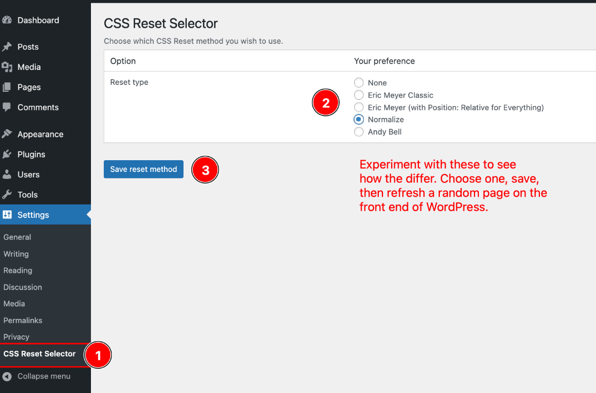

# How to Build a Simple WordPress Theme from Scratch

## Official Wordpress reference page for theme structure

See: https://yoast.com/wordpress-theme-anatomy/

## 1. Base Setup

Before starting the actual theme building process, please set up your WordPress work environment:

### 1.1 WordPress Studio

Make sure to use **Wordpress Studio** as it is the simplest and fastest way to run Wordpress. 

### 1.2 Required Plugins

Please install and activate these plugins on your WordPress site:

- [Show Current Template](https://wordpress.org/plugins/show-current-template/)
- [Theme Check](https://wordpress.org/plugins/theme-check/)

### 1.3 JACGWD CSS Reset Selector plugin from GitHub

Download this custom plugin from GitHub as a zip file and upload it from your computer.

- Download [JACGWD CSS Reset Selector](https://github.com/JACGWD/CSS-Reset-Selector/archive/refs/heads/main.zip)
- In WordPress: Plugins > Add New Plugin > Upload Plugin (at top)
- Select the downloaded zip file.
- Activate the plugin.

#### 1.3.1: Select a Reset option

Choose one of these options, and Save. View a page on the site, then go back and select andother option, save and come back to the page and refresh it again to see how the different resets affect the default layout of the page.

### 1.4 Create a theme folder in wp-content
- Navigate to /wp-content/themes/ and create a new folder called "your-name". 
- Ex: "billy-poppins". 
- Make sure to give it a name **without spaces or capitalized letters**.

### 1.5 Create empty files in the theme folder

- Create a header.php file
- Create a footer.php file
- Create a functions.php file
- Create a sidebar.php file
- Create a index.php file
- Create an img folder for your **css background images** (not content images - those are uploaded via the Wordpress interface and saved automatically into the wp-content/uploads folder)
- Create an fonts folder
- Create a js folder (for javascripts)
- Create a style.css file

### 1.6 Diagram of the files & folders structure

(Do not copy/paste this part!)

        wp-content/themes/billy-poppins
        ├── footer.php
        ├── functions.php
        ├── header.php
        ├── img/
        ├── fonts/
        ├── js/
        ├── index.php
        ├── style.css
        ├── search.php
        └── sidebar.php

<blockquote>

1. Open any page on your web site.
2. Also right-click the web page and select "View Page Source" to see the HTML. 
3. Refresh the web page and the source code page after every change to see what happens.

</blockquote>        

### 1.7 Create the theme preview artwork

- In Photoshop, create a blank document 1200px wide x 900px high
- Add any sort of background artwork you like for it
- Preferably simple backgrounds compress well.
- **Add your name** as a layer on top
- Save the file as a PNG file inside your theme folder.
- The file must be called "screenshot.png".
- To minimize the file size, avoid photographs and use flat colors. (The theme checker will complain about heavy file sizes.)
- After creating the file, run it through [ImageOptim](https://imageoptim.com/mac) to optimize it and reduce the file size.
  

## 2. Building a WordPress Theme in 25 Steps

### Step 2.1: Add the comment block to the style.css file

Although it is just a comment, WordPress depends on this information to make the whole system work. 

- Copy the code below to your CSS stylesheet.
- Change the theme name and author to your own.
- Set the author URL to your GWD portfolio site
- Edit the Text Domain (the text domain is the key info that helps WP translate a site).  It should be the same as theme name, but with no spaces, and no capitals.

        /*
        Theme Name: Billy-Poppins
        Author: Billy Poppins
        Author URI: https://www.graphicandwebdesign.ca
        Description: Student learning theme
        Version: 1.0
        License: GNU General Public License v2 or later
        License URI: http://www.gnu.org/licenses/gpl-2.0.html 
        Tested up to: 6.7
        Requires PHP: 7
        Text Domain: billy-poppins

        This theme, like WordPress, is licensed under the GPL.
        Use it to make something cool, have fun, and share what you've learned with others.
        */

        /* END STEP 2.1 */

### Step 2.2: Add your color palette to style.css

Start your color palette adding some default CSS variables to style.css:

    /* START STEP 2.2 */

    /* COLOR PALETTE */
        :root {
            --main-bg-color: rgb(255, 255, 255);
            --main-fg-color: rgb(1, 35, 70);
            --titles-color: #1c0263;
            --bodytext-color: #444444;
            --accent-color: rgb(63, 77, 159);
            --highlight-color: #f3c;
            --default-font: "helvetica neue", helvetica, arial, sans-serif;
        }

        body {
            background-color: var(--main-bg-color);
        }

        h1.h2,h3,h4,h5,h6,legend,label {
            color: var(--titles-color);
        }

        p,li {
            color: var(--bodytext-color);
        }

        a:link {
            color: var(--accent-color);
        }

        a:hover {
            color: var(--accent-color);
            text-decoration: underline;
        }

        a:visited {
            color: var(--bodytext-color);
            text-decoration: dotted;
        }

        a:active {
            color: var(--highlight-color);
        }

        html {font-size: 100%;}    

        /* required wordpress classes */
        .wp-caption {
            font-family: var(--default-font);
        }

        .wp-caption-text {
             font-family: var(--default-font);
        }

        .screen-reader-text  {
             font-family: var(--default-font);
        }

        .sticky {
             font-family: var(--default-font);
        }

        .gallery-caption {
             font-family: var(--default-font);
        } 

        .bypostauthor {
             font-family: var(--default-font);
        } 

        .alignright {text-align: right;}

        .alignleft {text-align: left;}

        .aligncenter {text-align: center;}  

        /* END STEP 2.2 */      

#### Important

Go to Appearance > Themes and activate your theme

<blockquote>

1. Open any page on your web site.
2. Also right-click the web page and select "View Page Source" to see the HTML. 
3. Refresh the web page and the source code page after every change to see what happens.

</blockquote>

### Step 2.3: Add the following code to index.php

        <?php  // START STEP 2.3
        // Add this to all your php files for added security

        if (!defined('ABSPATH'))
            exit; 
            // Exit if accessed directly. 
            // Ex: Not being called up directly by index.php or some other theme PHP file
        ?><!--  START WORDPRESS GET_HEADER CONTENT IN INDEX.PHP -->
        <?php get_header(); ?>
        <?php // this function loads the header.php file ?>

        <!--  END WORDPRESS GET_HEADER CONTENT IN INDEX.PHP -->
        <!-- STEP 2.3 ENDS HERE -->

<blockquote>

1. Open any page on your web site.
2. Also right-click the web page and select "View Page Source" to see the HTML. 
3. Refresh the web page and the source code page after every change to see what happens.

</blockquote>

### Step 2.4: Add the following code to header.php

        <?php  // START STEP 2.4
        // Add this to all your php files for added security
        if (!defined('ABSPATH'))
            exit; 
            // Exit if accessed directly. 
            // Ex: Not being called up directly by index.php or some other theme PHP file
        ?>
        
        <!-- START STEP 2.4 ADD HEADER.PHP CODE -->
        <!DOCTYPE html>
        <html>

        <head>
            <meta charset="utf-8">

            <meta name="viewport" content="width=device-width, initial-scale=1">
            <?php // the viewport metatag is what makes a design responsive ?>
            
            <title></title>
        </head>

        <body>

        <header>
            <nav>
            </nav>
        </header>
        <!-- END STEP 2.4 ADD HEADER.PHP CODE -->
        <?php  // END OF STEP 2.4 ?>

<blockquote>

1. Open any page on your web site.
2. Also right-click the web page and select "View Page Source" to see the HTML. 
3. Refresh the web page and the source code page after every change to see what happens.

</blockquote>

### Step 2.5: Add the following code to footer.php

        <?php 
        // START STEP 2.5 BUILD FOOTER
        // Add this to all your php files for added security

            if (!defined('ABSPATH'))
              exit; 
                 // Exit if accessed directly. 
                 // Ex: Not being called up directly by index.php or some other theme PHP file
             ?>

          <footer>
        
          </footer>

        </body>
        </html><?php // END STEP 2.5 BUILD FOOTER ?>

<blockquote>

1. Open any page on your web site.
2. Also right-click the web page and select "View Page Source" to see the HTML. 
3. Refresh the web page and the source code page after every change to see what happens.

</blockquote>

### Step 2.6: Add the following code to index.php 

Make sure to add this code at the bottom of index.php!

        <!-- START STEP 2.6 ENABLE FOOTER -->

            <?php get_footer(); ?>
            <?php // this functions loads the footer.php file ?>   
    
    
        <!-- END STEP 2.6 ENABLE FOOTER -->

<blockquote>

1. Open any page on your web site.
2. Also right-click the web page and select "View Page Source" to see the HTML. 
3. Refresh the web page and the source code page after every change to see what happens.

</blockquote>

### Step 2.7: Add the following code inside footer.php 

Make sure to add this code **after** the \</footer> tag **but before** \</body>!

        <!-- START STEP 2.7 WP_FOOTER CONTENT -->

            <?php wp_footer(); ?>
            <?php // this functions loads the footer content ?>   
    
    
        <!-- END STEP 2.7 WP_FOOTER CONTENT -->
<blockquote>

1. Open any page on your web site.
2. Also right-click the web page and select "View Page Source" to see the HTML. 
3. Refresh the web page and the source code page after every change to see what happens.

</blockquote>

### Step 2.8: Add the H1 and Wordpress loop to the index.php file, before the footer include

- After the code you pasted in **Step 2.3**, add the following code.
- Add the code **before** the Step 2.6 footer code.
- Make sure to **edit the text domain to match** the one you wrote in the CSS file.

        <!-- START STEP 2.8 ADD H1 AND WORDPRESS LOOP -->
        <h1><?php the_title(); // AUTOMATICALLY ADDS THE PAGE TITLE ?></h1>
        
        <!-- opening flex-container will go here -->
        
        <main id="post-<?php the_ID(); ?>" <?php post_class(); ?>>
        <?php // NOTE IDs AND CLASSES ARE AUTOMATICALLY ADDED HERE ?>

        <!-- START WORDPRESS LOOP -->

            <?php 
                if ( have_posts() ) : 
                while ( have_posts() ) : the_post();
                    the_content();
                endwhile;
            else :
                _e( 'Sorry, no posts matched your criteria.', 'billy-poppins' );
                // MAKE SURE TO CHANGE BILLY-POPPINS HERE
            endif;
            ?>

            <?php wp_link_pages(); ?>

        <!-- END WORDPRESS LOOP -->    
        </main>

         <!-- END STEP 2.8 ADD H1 AND WORDPRESS LOOP -->
        <!-- closing flex-container will go here -->

<blockquote>

1. Open any page on your web site.
2. Also right-click the web page and select "View Page Source" to see the HTML. 
3. Refresh the web page and the source code page after every change to see what happens.

</blockquote>

#### Links to Better Understand What the Loop Is & What It Does

- [https://www.wpbeginner.com/glossary/loop/](https://www.wpbeginner.com/glossary/loop/)
- [https://developer.wordpress.org/themes/basics/the-loop/](https://developer.wordpress.org/themes/basics/the-loop/)
- [https://www.hostinger.com/tutorials/the-loop-wordpress](https://www.hostinger.com/tutorials/the-loop-wordpress)
- [https://kinsta.com/blog/wordpress-loop/](https://kinsta.com/blog/wordpress-loop/)
    

### Step 2.9: Add the following code to functions.php

This block of code does two very important basic things:

1. Auto-updates the plugins and themes to help prevent any insecure software from being on your site for too long. Basically, if there is an update you will have it applied to your site automatically.
2. Loads the CSS stylesheet.

            <?php
        // Add this to all your php files for added security

        if (!defined('ABSPATH'))
            exit; 
            // Exit if accessed directly. 
            // Ex: Not being called up directly by index.php or some other theme PHP file
        
        // FOR COLLEGE NETWORK SECURITY
        // FORCE AUTO-UPDATE EVERYTHING (WP CORE, PLUGINS AND THEMES)
        add_filter( 'allow_minor_auto_core_updates', '__return_true' );         // ENABLE MINOR UPDATES
        add_filter( 'allow_major_auto_core_updates', '__return_true' );         // ENABLE MAJOR UPDATES
        add_filter( 'auto_update_plugin', '__return_true' );                    // UPDATE PLUGINS
        add_filter( 'auto_update_theme', '__return_true' );                     // UPDATE THEMES 

        /*
        * Proper way to enqueue scripts and styles.
        */
        function billypoppins_theme_scripts() {
            wp_enqueue_style( 'billypoppins', get_stylesheet_uri() );
        }
        add_action( 'wp_enqueue_scripts', 'billypoppins_theme_scripts' );

        // END STEP 2.9

<blockquote>

1. Open any page on your web site.
2. Also right-click the web page and select "View Page Source" to see the HTML. 
3. Refresh the web page and the source code page after every change to see what happens.

</blockquote>

### Step 2.10: In functions.php: Control the name and number of menus

This is where you can add the number of menus you want to have in your WordPress theme.

        /*  STEP 2.10 ADD THE MENUS */

        function add_my_menus() {
            register_nav_menus(
            array(
                'header-menu' => __( 'Header Menu', 'billy-poppins' ),
                'footer-menu' => __( 'Footer Menu', 'billy-poppins' ),
                'social-menu' => __( 'Social Menu', 'billy-poppins'),
                // YOU CAN ADD AS MANY MENUS AS YOU WANT HERE
            )
            );
        }
        add_action( 'init', 'add_my_menus' );

        // END STEP 2.10 ADD THE MENUS

<blockquote>

#### Go see the menus

Go to Appearance > Menus, click "Manage Locations", then "Select a Menu". Your new menus are there.

</blockquote>

### Step 2.11: In header.php, add the following to add the menu to the page (and customize the nav code)

Add the following code **inside the \<nav> tag** of header.php. Feel free to experiment with the values to see what happens when you change them.

        <!-- START STEP 2.11 ADD THE MENU TO THE PAGE -->
        <?php 
            wp_nav_menu(array(
                'menu_class'	  	=> 'primary-menu',  // adds: class="primary-menu"
                'theme_location' 	=> 'header-menu',   // is controlled as the "header menu" in the backend
                'menu_id'	    	=> 'menu',          // adds: id="menu"
                'container'         => 'div',           // menu is inside a div
            ));
        ?>
        <!-- END STEP 2.11 ADD THE MENU TO THE PAGE -->

<blockquote>

1. Open any page on your web site.
2. Also right-click the web page and select "View Page Source" to see the HTML. 
3. Refresh the web page and the source code page after every change to see what happens.

</blockquote>

### Step 2.12: In header.php, call up the Wordpress contents of \<head>

Paste the following code inside the \<head> tag, above the \<title> tag:

        <!-- START 2.12 WP_HEAD GET DYNAMIC HEADER CONTENT -->

        <?php wp_head(); ?>

        <!-- END 2.12 WP_HEAD GET DYNAMIC HEADER CONTENT -->

<blockquote>

1. Open any page on your web site.
2. Also right-click the web page and select "View Page Source" to see the HTML. 
3. Refresh the web page and the source code page after every change to see what happens.

</blockquote>

### Step 2.13: Add the search form to header.php

**Inside the \<body> tag**, near the top, add this code to call up the search form. Note that you can:

- Add it above \<header>
- Add it inside \<header>
  - Before \<nav>
  - After \<nav>
- Add it below \<header>

This will change the order of the HTML.

        <!-- START STEP 2.13 ADD SEARCH FORM -->

        <?php get_search_form(); ?>

        <!-- END STEP 2.13 ADD SEARCH FORM -->       

<blockquote>

1. Open any page on your web site.
2. Also right-click the web page and select "View Page Source" to see the HTML. 
3. Refresh the web page and the source code page after every change to see what happens.

</blockquote>

### Step 2.14: Add new features to the theme

Copy this block of code, and add it to **functions.php**:

        // START STEP 2.14 ADD ADDITIONAL CUSTOM FEATURES TO THE SITE THEME
        // https://developer.wordpress.org/reference%2Ffunctions%2Fadd_theme_support%2F/

        function billypoppins_theme_init(){

            add_theme_support('post-thumbnails');
            // Enable featured images and post thumbnails

            add_theme_support( 'automatic-feed-links' );
            This feature adds RSS feed links to HTML <head>.
            
            add_theme_support('title-tag');
            // Adds a custom <title> tag in the <head>

            add_theme_support( 'custom-logo', array(
                'height'               => 100,
                'width'                => 400,
                'flex-height'          => true,
                'flex-width'           => true,
                'header-text'          => array( 'site-title', 'site-description' ),
                'unlink-homepage-logo' => false,
                ) );
            // Adds a custom logo selector in Appearance > Customize > Site Identity

            add_theme_support( "responsive-embeds" );
            // The embed blocks automatically apply styles to embedded content to reflect the aspect ratio of content that is embedded in an iFrame.

            add_theme_support( "align-wide" );
            // Some blocks such as the image block have the possibility to define a “wide” or “full” alignment
            
            add_theme_support('html5',
            array(
                'comment-list', 
                'comment-form', 
                'search-form', 
                'gallery', 
                'caption', 
                'figure', 
                'figcaption', 
                'nav', 
                'section')
            // Forces WP to use semantic HTML 5 tags such as <figure> and <figcaption>
            );
            }
            
            // ADDS THESE FEATURES TO WP
            add_action('after_setup_theme', 'billypoppins_theme_init');

            // END STEP 2.14 ADD ADDITIONAL CUSTOM FEATURES TO THE SITE THEME

<blockquote>

The only thing you will notice in the updated HTML is a second \<title> tag, with an actual title inside it, well above the manually added title tag.

</blockquote>

#### Step 2.14.2: Delete the old \<title>

The code above (step 2.14) automatically includes a title tag (line 574) that displays the appropriate page title. Remove the \<title>\</title> tag you added to header.php, just before \</head>. 

<blockquote>

1. Open any page on your web site.
2. Also right-click the web page and select "View Page Source" to see the HTML. 
3. Refresh the web page and the source code page after every change to see what happens.

</blockquote>

## Customize header.php

### Step 2.15: Customize the language of the HTML tag

This code gets added to the \<html> tag to let browsers and search engines know what language the page is written in.

#### Add this:
    
        <?php language_attributes(); ?>

#### To the HTML tag, like this:

        <!-- START STEP 2.15 ADD HTML LANGUAGE ATTRIBUTES -->

        <html <?php language_attributes(); ?>>

        <!-- END STEP 2.15 ADD HTML LANGUAGE ATTRIBUTES -->

<blockquote>

1. Open any page on your web site.
2. Also right-click the web page and select "View Page Source" to see the HTML. 
3. Refresh the web page and the source code page after every change to see what happens.

</blockquote>
    
### Step 2.16: Customize the character set 

Add this line **at the top** of the \<head> tag on header.php, replacing the current \<meta charset="utf-8">:

    <!-- START STEP 2.16 ADD CHARACTER SET -->
    <meta charset="<?php bloginfo( 'charset' ); ?>" />
    <!-- END STEP 2.16 ADD CHARACTER SET -->

<blockquote>

1. Open any page on your web site.
2. Also right-click the web page and select "View Page Source" to see the HTML. 
3. Refresh the web page and the source code page after every change to see what happens.

</blockquote>

### Step 2.17: Add support for custom body classes      

#### Add this:

    <?php body_class(); ?> and <?php wp_body_open(); ?>

 #### To the body tag, like this:   

    <!-- START STEP 2.17 CUSTOMIZE BODY CLASS & OPEN -->

    <body <?php body_class(); ?>>
    <?php wp_body_open(); ?>

    <!-- END STEP 2.17 CUSTOMIZE BODY CLASS & OPEN -->

<blockquote>

1. Open any page on your web site.
2. Also right-click the web page and select "View Page Source" to see the HTML. 
3. Refresh the web page and the source code page after every change to see what happens.

</blockquote>

### Step 2.18: Add the header branding areas

On header.php use the following code to replace the starting \<header> tag. This will add branding elements to our header, with logo and company name at the top of the page.

**Do not replace the search form, nav tag, menu or closing \<header> tag.**
    
    <!-- START STEP 2.18 BRANDING & DESCRIPTION -->
    <header>
        

            <a href="<?php echo esc_url(home_url()); ?>">
            <?php bloginfo('name'); ?>
            </a>
        

        
        

                <?php bloginfo('description'); ?>
                <?php // This is the WP site tagline, not the meta description tag ?>
        

    <!-- END STEP 2.18 BRANDING & DESCRIPTION -->

<blockquote>

1. Open any page on your web site.
2. Also right-click the web page and select "View Page Source" to see the HTML. 
3. Refresh the web page and the source code page after every change to see what happens.

</blockquote>

### Step 2.19: Add the code for the search results

Add the following code to search.php:

        <?php // START STEP 2.19 CREATE SEARCH RESULTS PAGE
            // Add this to all your php files for added security
            if (!defined('ABSPATH'))
                exit;
            get_header(); ?>
            <!-- START STEP CREATE SEARCH RESULTS PAGE -->
            

            <main id="post-<?php the_ID(); ?>" <?php post_class(); ?>>    
            <?php
            $s=get_search_query();
            $args = array(
                            's' =>$s
                        );

                        // The Query
            $the_query = new WP_Query( $args );
            if ( $the_query->have_posts() ) {
                    _e("<h1>Search Results for: ".get_query_var('s')."</h1>");
                    while ( $the_query->have_posts() ) {
                    $the_query->the_post();
                            ?>
                                <li>
                                    <a href="<?php the_permalink(); ?>"><?php the_title(); ?></a>
                                </li>
                            <?php
                    }
                }else{
            ?>
                    <h1>No Results Found For These Search Terms</h1>
                    

                    
Sorry, but nothing matched your search criteria. Please try again with some different keywords.

                    

            <?php } ?>
            </main>

            <?php get_sidebar(); ?>
            

            <?php get_footer(); ?>

            <!-- END STEP 2.19 CREATE SEARCH RESULTS PAGE -->

<blockquote>

1. Perform a search on your web site.
2. The results are displayed using this new template.

</blockquote>

## Customize the default page template

### Step 2.20: Add the flex-container to index.php

Add the following div to your index.php before the \<main> tag:

    <!-- START STEP 2.20 ADD FLEX CONTAINER -->
    

We do not want to add the H1 tag inside the flex container as the H1 would become the first column. We only want \<main> and the \<aside> the be columns with the flexbox.

Add the closing tag for the flex-container **after the \<main>**:

    <!-- END STEP 2.20 ADD FLEX CONTAINER -->
    

<blockquote>

1. Open any page on your web site.
2. Also right-click the web page and select "View Page Source" to see the HTML. 
3. Refresh the web page and the source code page after every change to see what happens.

</blockquote>

## Customize the footer

### Step 2.21: Add the following code to **footer.php**. 

Add this code inside the \<footer> tag inside footer.php.

This will add two menus:

1. The default footer navigation menu.
2. The social media icons menu for sending visitors to your different social media accounts. (Note: this is not a set of "share" buttons. It is just links to your profiles.)

        <!-- START STEP 2.21 ADD FOOTER MENUS -->
        <nav>
            <?php wp_nav_menu( array( 
                'theme_location' => 'footer-menu', 
                'container_class' => 'footer-nav' 
                ) ); ?>
        </nav>

        <nav>
            <?php wp_nav_menu( array( 
                'theme_location' => 'social-menu', 
                'container_class' => 'footer-social' 
                ) ); ?>
        </nav>

        
&copy; <?php echo bloginfo('name') ?>, <?php echo date("Y"); ?>

        <!-- END STEP 2.21 ADD FOOTER MENUS -->

 <blockquote>

1. Open any page on your web site.
2. Also right-click the web page and select "View Page Source" to see the HTML. 
3. Refresh the web page and the source code page after every change to see what happens.
4. By default, you will see all the links on every menu.
5. When you create the different menus in the backend, the menus will appear different.
</blockquote>

 ### Step 2.22: Add the sidebar

 Add the sidebar include call **to index.php**, **before the flex-container's closing div** tag.       
        
        <!-- START STEP 2.22 ADD SIDEBAR -->

        <?php get_sidebar(); ?>

        <!-- END STEP 2.22 ADD SIDEBAR -->

<blockquote>

Nothing will change before you do the next steps.

</blockquote>

### Step 2.23: Add sidebar generating code

Add the following code to sidebar.php:

        <?php // START BUILDING SIDEBAR
            // Add this to all your php files for added security

            if (!defined('ABSPATH'))
                exit;

            if ( is_active_sidebar('widget_1')  ) : ?>
                    <aside class="sidebar widget-area" role="complementary">
                    <?php dynamic_sidebar( 'widget_1' ); ?>
            </aside>
            <?php endif; 
        // END BUILDING SIDEBAR ?>

<blockquote>

1. Open any page on your web site.
2. Also right-click the web page and select "View Page Source" to see the HTML. 
3. Refresh the web page and the source code page after every change to see what happens.

</blockquote>

### Step 2.24: Enable the sidebar in functions.php

        // START STEP 2.24 ADDING WIDGET SUPPORT

        function billypoppins_widgets_init() {

            register_sidebar( array(
                'name'          => 'Widget sidebar',
                'id'            => 'widget_1',
                'before_widget' => '<section>',
                'after_widget'  => '</section>',
                'before_title'  => '<h3 class="widget-title">',
                'after_title'   => '</h3>',
            ) );

        }
        add_action( 'widgets_init', 'billypoppins_widgets_init' );
        // END STEP 2.24 ADDING WIDGET SUPPORT

<blockquote>

#### Note

- "Widgets" will now appear in the WP sidebar menu. 
- You must add at least one widget in Appearance > Widgets, otherwise the sidebar will not show up at all on the page.

</blockquote>

<blockquote>

1. Open any page on your web site.
2. Also right-click the web page and select "View Page Source" to see the HTML. 
3. Refresh the web page and the source code page after every change to see what happens.

</blockquote>

### Step 2.25: Enable the custom logo

Add this code to header.php, immediately after \<header>, before \
:

    <!-- START STEP 2.25 ADD CUSTOM LOGO -->
      <?php 
        // Enables Wordpress custom logo
        // See: https://developer.wordpress.org/reference%2Ffunctions%2Fadd_theme_support%2F/#custom-logo
        
            if ( function_exists( 'the_custom_logo' ) ) {
            the_custom_logo();
            }
        ?>
        <!-- END STEP 2.25 ADD CUSTOM LOGO -->

<blockquote>

1. Open the admin page of your web site.
2. Go to Appearance > Customize > Site Identity
3. You can now choose a logo.

</blockquote>

### Step 2.26: Read Me

In the theme folder, add a readme.txt file. 
You can add: "This theme is a school project." or something similar.

### Step 2.27: Validate the Theme

Use the **Theme Check** plugin to validate your theme.

Note that the checker will output multiple warnings and recommendations. **However you do not want to see any errors in this exercise.**